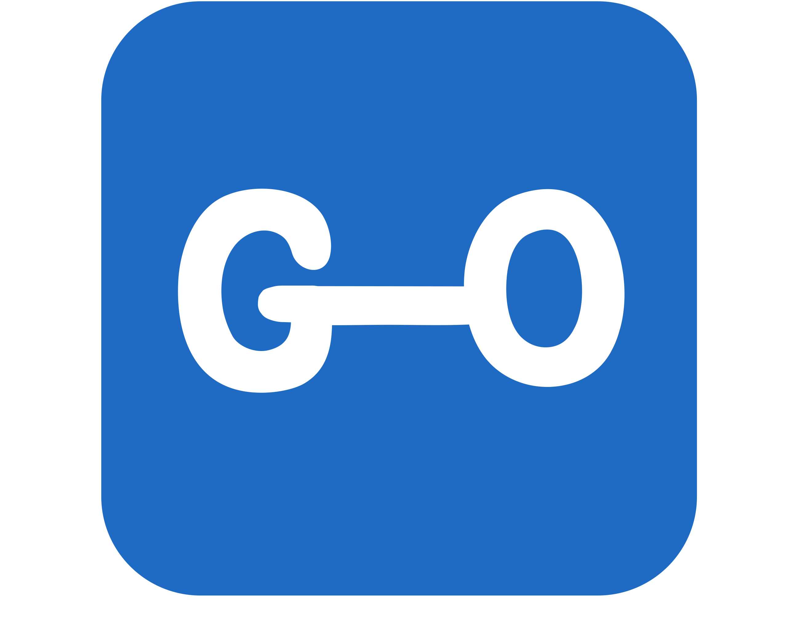

<p align="center">
    <br>
    내가 운동 기록하려고 만든 서비스, GO
</p>

[](https://www.codefactor.io/repository/github/parkilhoon/go)
[](https://circleci.com/gh/ParkIlHoon/go/tree/main)
[](https://codecov.io/gh/ParkIlHoon/go)

## 기능
* 나만의 루틴 관리
* 루틴을 사용한 편리한 운동 기록
* 운동 기록을 바탕으로한 통계

## 프로젝트 구성
* main-application : 메인 웹 애플리케이션
* exercise : 운동 도메인 모듈
* routine : 루틴 도메인 모듈
* record : 기록 도메인 모듈
* statistic : 통계 도메인 모듈

## 로컬 개발환경 세팅
### Docker 설치
[docker 공식 사이트](https://www.docker.com/get-started/)
### docker-compose 실행
```shell
cd dev-script
docker-compose pull
docker-compose -p go_project up -d
```